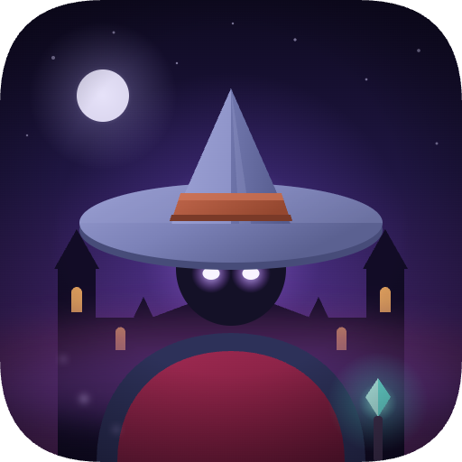
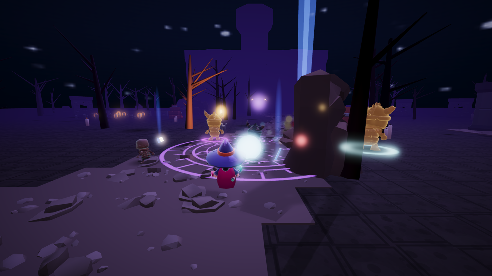
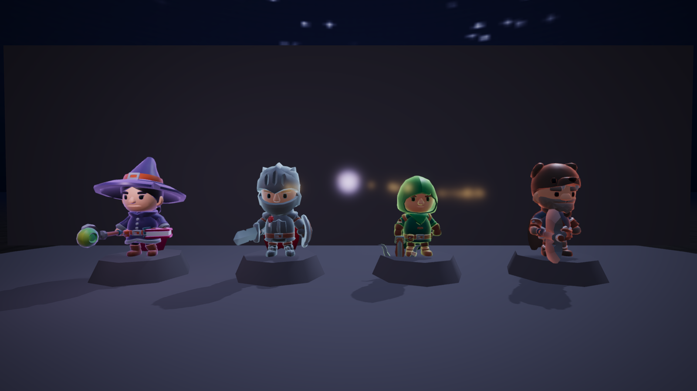
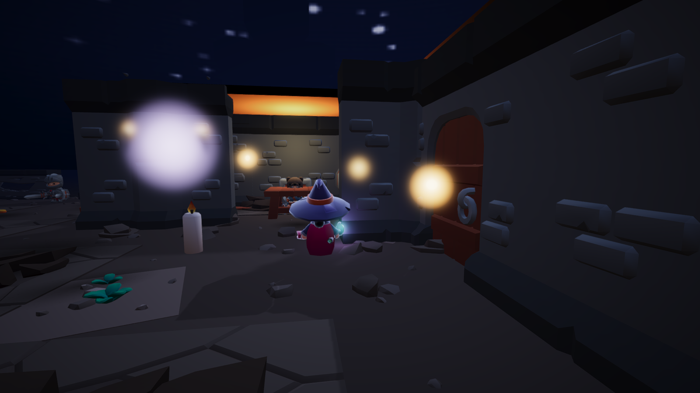
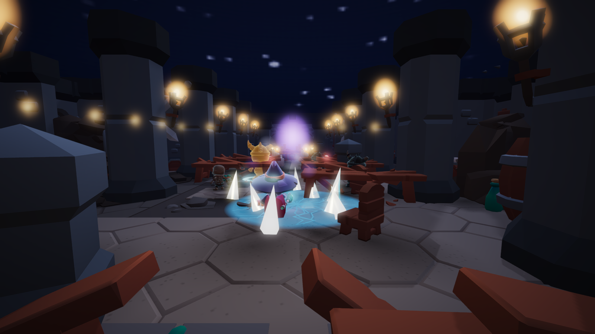
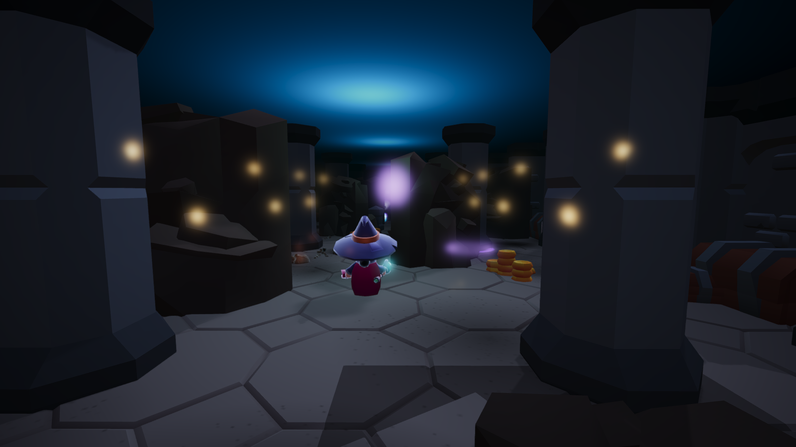
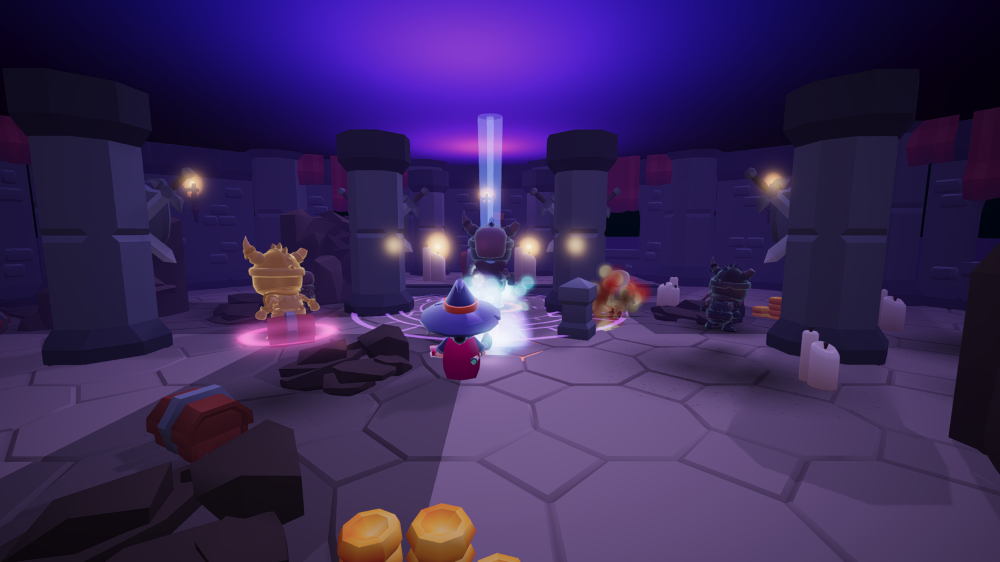
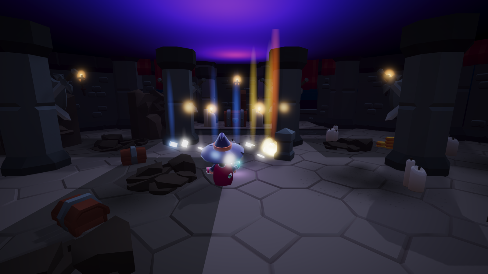

<p align="center">
  
</p>

<h1 align="center">Necromantle</h1>

<p align="center"><em>The dead of Hollowmere are not staying buried.</em></p>

<p align="center">
  <a href="https://miguelsolorio.github.io/necromantle/"><strong>Play it in the browser</strong></a>
</p>



Necromantle is a Diablo-style action RPG that you play over the shoulder instead of from above. You pick a class, walk out of a village that has stopped burying its dead, and fight your way up to the cathedral and down into the crypt under it. Kill a pack, take the loot, get stronger, meet a bigger pack.

It runs in the browser on WebGPU, falls back to WebGL2, and is built with Babylon.js and TypeScript. There's no game engine editor behind it and no UI framework: the world is assembled from modular kits in code, and the HUD is plain HTML and CSS.

## Running it

```bash
npm install
npm run dev
```

Then open http://127.0.0.1:5173. Models are committed under `public/assets` and the score is generated at runtime, so a fresh clone plays without any extra download step.

| Script | What it does |
| --- | --- |
| `npm run dev` | Vite dev server on port 5173 |
| `npm run dev:lan` | The same server on every interface, port 5174, for a phone on the same Wi-Fi (plain http, so WebGL2) |
| `npm run build` | Typecheck, then build to `dist/` |
| `npm run preview` | Serve the production build |
| `npm run typecheck` | `tsc --noEmit` |
| `npm run assets` | Re-fetch the raw CC0 packs into `public/assets/_packs` (git-ignored) |

Pushes to `main` deploy to GitHub Pages through `.github/workflows/deploy.yml`.

## Controls

| Input | Action |
| --- | --- |
| `W` `A` `S` `D` | Move |
| Mouse | Aim (click the canvas to lock the pointer) |
| `Shift` | Sprint |
| Left mouse | Slot 1, the generator |
| Right mouse | Slot 2, the spender |
| `1` `2` `3` `4` | Slots 3 to 6, unlocked at levels 3, 4, 6 and 10 |
| `Q` | Potion |
| `E` | Talk, or take the door |
| `I` or `Tab` | Inventory |
| `M` | Mute |
| `R` | Respawn at the checkpoint |
| `F1` / `F2` | Dev panel / hide the HUD |

On a phone or tablet the same actions are on screen:

| Touch | Action |
| --- | --- |
| Left half of the screen | Floating stick to move; push it past the ring to sprint |
| Drag anywhere else | Aim the camera |
| Hold a skill in the bottom-right arc | Use it (the big one is the generator) |
| Potion, prompt, bag and pause buttons | Potion, talk or take the door, inventory, settings |

Phones play in landscape. Add the page to the home screen and it opens full screen.

URL flags: `?webgl=1` forces the WebGL2 path, `?new=1` wipes the save, `?play=<class>` skips the title screen, `?nolock` drives the game without pointer lock for automated tests, `?touch=1` forces the touch controls on a desktop, `?quality=low|high` forces the render tier, and `?dev=1` opens the dev panel. WebGPU needs a secure page, so the game served over a LAN address falls back to WebGL2; the deployed site is https.

## Four classes



Each class has its own rig, its own resource rule, and six abilities of its own. Every class earns them on the same schedule, at levels 1, 2, 3, 4, 6 and 10.

| Class | Resource | How it builds | Abilities |
| --- | --- | --- | --- |
| **Arcane Sorcerer** | Arcane Energy | Regenerates slowly, and Arcane Bolt builds it on hit | Arcane Bolt, Astral Orb, Rift Step, Flame Nova, Frost Field, Cataclysm |
| **Sepulcher Knight** | Fury | Every hit dealt or taken, and it decays out of combat | Cleave, Judgement, Shield Rush, Iron Ward, Grave Stomp, Bulwark |
| **Grave Hunter** | Focus | Fills while you stand still, and on every kill | Bolt Shot, Fan of Bolts, Vault, Caltrops, Mark, Rain of Bolts |
| **Pale Reaver** | Blood | Hits and kills feed it, and it drains slowly | Rend, Whirl, Leap, Frenzy, Bleed Storm, Harvest |

Each class keeps its own save slot, so you can leave the Knight halfway up the road and start the Hunter from the village.

## The run

Six areas. Hollowmere is the hub and nothing there fights you. The other five each run three waves, and the door onward stays sealed until they're down.

**Hollowmere** is the village. Maren at the forge patches you up, and Warden Tal explains why the road north is empty.



**Sexton's Road** is the wilderness between the village and the ridge: dead trees, graves, and the first packs that surround you properly.

**The Outer Court** puts you on the cathedral steps. **The Nave** is the cathedral itself, torch-lit down a row of pillars with the rift burning at the altar.



**The Crypt** goes under it, lit teal instead of gold, and the packs stop arriving politely.



**The Ossuary** is the throne of the Hollow King, who summons help and does not fight fair.



## What's in it

**Combat** aims for the three seconds where you're overwhelmed and the three after it where you aren't. Soft targeting scores candidates by angle to the reticle, screen distance, range and line of sight, so rough aim connects. Hits stagger, burn, freeze, knock back and explode, and crits briefly scale simulation time without touching the render cadence.

**Enemies** are silhouettes first: swarming ghouls, armored fallen knights, ranged cultists, floating wraiths, elite brutes and necromancers that buff the rest. Elites get a gold rim, a floor aura, a nameplate and one affix: Scorched Ground, Blinking, Radial Volley, Summoner, Grasping or Chilling Aura.

**Loot** drops physically, bounces, glows and beams by rarity: white, blue, yellow, then orange for legendaries. There are eight equipment slots, and legendaries change rules rather than raising numbers. The Starfall Circlet splits the Astral Orb into three after four pierces. The Ashen Grimoire leaves burning ground behind Flame Nova.



**Progression** runs from level 1 to 10 across six ability unlocks and two passive slots. Passives are rule changes too: Arcane Momentum turns energy gain into speed, Chain Reaction makes burning kills explode.

**Saves** live in `localStorage`, one versioned slot per class, with a checkpoint at the head of each level that death returns you to.

**Audio** is generated at runtime through the Web Audio API. A layered horror bed under exploration, a Phrygian combat mode, and per-level moods that shift as you descend.

## How it's built

The stack is TypeScript in strict mode, Vite, and Babylon.js 9 with glTF assets. `createEngine` tries WebGPU and falls back to WebGL2, and both report which path is live in the dev panel.

The simulation runs at a fixed 1/60 s step in a set order: input, player, abilities, projectiles, enemies, status, damage and deaths, VFX and pooled lights, camera, then HUD. Rendering happens every frame. Collision is custom rather than physics-driven: kinematic capsules moved with `moveWithCollisions` against box colliders generated per kit placement, plus circle separation between agents on a spatial hash. Walkable height is answered analytically from slabs and ramps, so raycasts stay a fallback.

`docs/technical-architecture.md` covers the module map, the rendering setup, and the engine gotchas that cost the most time, including why every kinematic mover calls `computeWorldMatrix(true)` before it moves.

```
src/
  core/        engine, fixed-step loop, event bus, pools
  input/       keyboard, mouse, pointer lock
  rendering/   lights, fog, post pipeline, material plugins
  camera/      third-person spring arm with obstruction and shake
  player/      controller, animator, stats, resources
  combat/      targeting, damage, projectiles, areas, pickups
  abilities/   ability runtime, one module per class
  enemies/     manager, state machine, steering, archetypes
  vfx/         composed effects, particles, decals, pooled lights
  world/       the six levels, colliders, spawners, select stage
  ui/          HUD, inventory, title, dev panel
  content/     pure data: classes, abilities, enemies, items, palette
  loot/        generator and drops
  persistence/ versioned save slots
  audio/       procedural score and sfx
```

## Assets and credits

The art is CC0 placeholder work from [KayKit](https://kaykit.itch.io): the Adventurers and Skeletons character packs, and Dungeon Remastered for the architecture. Every folder with third-party files carries that pack's license next to them, and `docs/asset-conventions.md` maps logical asset ids to files.

Everything named in the game is original. Diablo III is a reference for pacing, readability and mood, and `docs/reference-analysis.md` is explicit about which rules were taken from looking at it.

## Docs

| File | What's in it |
| --- | --- |
| [`docs/game-design.md`](docs/game-design.md) | Systems, enemies, loot, the tension curve |
| [`docs/technical-architecture.md`](docs/technical-architecture.md) | Module map, update order, engine gotchas |
| [`docs/character-plan.md`](docs/character-plan.md) | How the four classes were specced |
| [`docs/asset-conventions.md`](docs/asset-conventions.md) | Asset ids, folders, licenses |
| [`docs/visual-gap-analysis.md`](docs/visual-gap-analysis.md) | What still looks like placeholder art |
| [`docs/music-plan.md`](docs/music-plan.md) | The procedural score |
| [`docs/mobile-plan.md`](docs/mobile-plan.md) | Touch controls, responsive layouts, the low render tier |
| [`docs/storyboard.html`](docs/storyboard.html) | The style frame the look was approved from |
